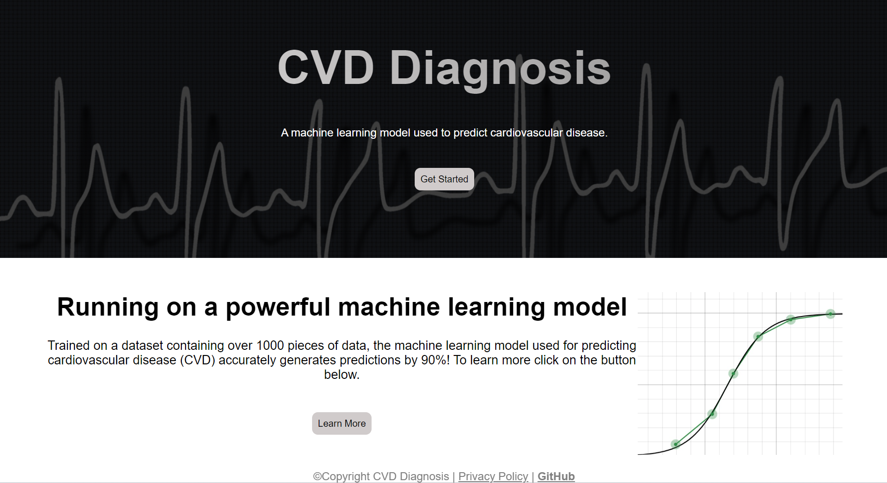

# CVD Diagnosis

Cardiovascular disease diagnosis tool using machine learning. Setup an account, login, and answer the screening questions to get results predicted by the model.
Developed by integrating a machine learning model in a Django backend REST API and a React frontend.
Authenticated used JSON web tokens, new users are stored in a cloud PostgreSQL database.
Live at [CVDdiagnosis](https://a7b4bea2-ffd6-433a-99e4-3765f7c02159.e1-us-cdp-2.choreoapps.dev/)

